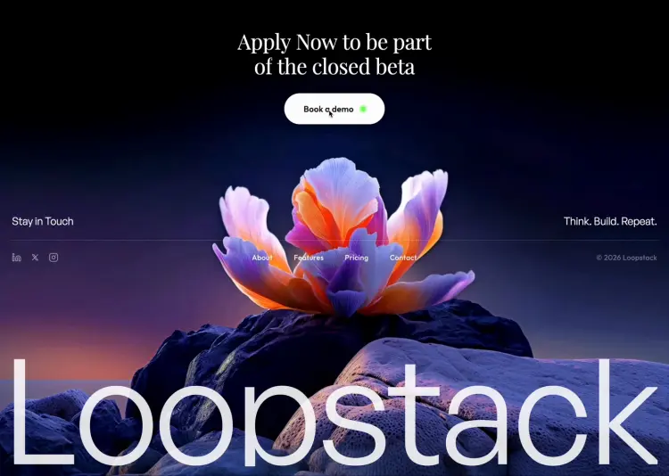

  

# Loopstack

**Think. Build. Repeat.**

One screen. No scroll. A looping flower video fills the viewport while a serif headline slides up word by word through a blur. A giant 22 vw wordmark spells out the brand letter by letter from the left edge. A glassmorphism cursor pill follows your pointer with physics lag, whispering *SAY HELLO!* in neon green. Everything lives on pure black — just the video, the type, and one pulsing green dot.

---

### What's inside

- **Flower video background** — looping `.mp4` filling the bottom 90% of the screen
- **Word-by-word headline reveal** — each word slides up from behind a clip mask and un-blurs
- **Letter-by-letter wordmark** — 21.9 vw brand name animates in from the left
- **Glassmorphism cursor** — frosted-glass pill with backdrop blur, lagging behind the pointer via LERP
- **Cursor ring** — outlined circle that expands 1.6× on button hover
- **Pulsing neon dot** — `#39FF14` green accent with expanding wave ring
- **Fixed footer** — social icons, nav links, copyright — all in a single horizontal bar
- **No scroll** — `overflow: hidden`, everything is above the fold

### Stack

Single HTML file. Three Google Fonts loaded via `@import`, vanilla JS for cursor physics and text splitting. Zero dependencies.

---

Concept case — no real company, no personal data.

